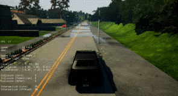
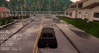
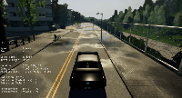
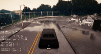

rl-CARLA
===============
## still working on!!!
Welcome to my repo! My experiment environment is Ubuntu16.04, python3.5 and tensorflow1.12.0. If you have any issue about the code, please don't hesitate to contact me.

# Vanilla Version
The basic idea is using Raw Image as state spaces to train DDPG Agent. The network architecture is quite simple, if you want to know more, you can check [here](https://github.com/zhangfuyang/rl_CARLA/blob/master/src/network/ddpg_network.py). In order to evaluate the performance of the RL method, we first used supervised learning to train a network as baseline. Then we investigate the performance of RL methods (DDPG), both with and without pretraining.
## Demo
### imitation
   

### DDPG
     

## Result
 

## Installation

### Clone the git repository

  $ git clone https://github.com/zhangfuyang/DDPG-CARLA.git
  
  $ cd DDPG-CARLA & pip -r requirements.txt
  
  (Use $DDPG_DIR as the root directory of the source)
  
### Install Carla Simulator

1. Download the Carla
 you can just download the compiled version from [here](https://github.com/carla-simulator/carla/releases/tag/0.8.2) . Make sure the version of the simulator is 0.8.2(stable), I'm not sure if other development or old stable versions are compatible.

2. extract to the directory you want
     $ tar -xvf CARLA_0.8.2.tar.gz $CARLA_DIR
 
 
## Training
1. First start the Carla server
    cd $CARLA_DIR
    ./CarlaUE4.sh -carla-server -benchmark -fps=10
    
2. Run ddpg_main.py
    cd $DDPG_DIR
    python ddpg_main.py
    
## Test the model
1. Start the Carla server

2. python test_ddpg.py -model_path='models/'

## Some Detail of implementation
1. Use pretrain Network https://github.com/carla-simulator/imitation-learning to extract feature. Then connected with actor and critic net. 
 
 
